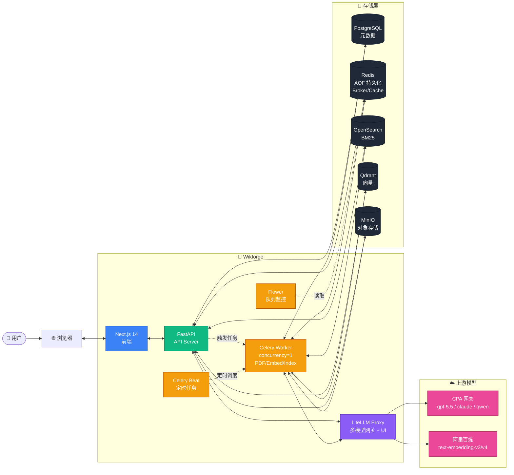
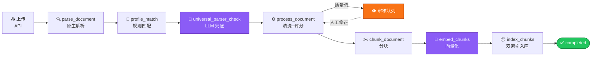
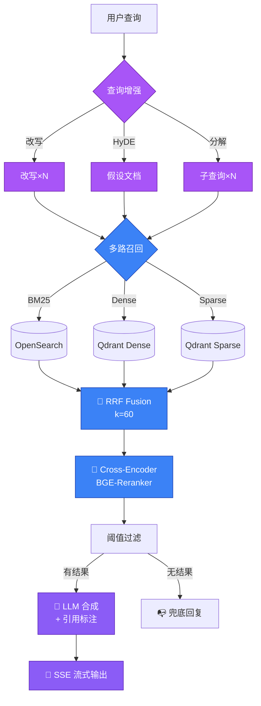

# 前言
本项目为学习项目，开源项目来自github,上传初心是认为该项目的内容非常适合刚学习完langchian的rag的人，这个项目中基本是通过手搓实现的rag，并没有langchain中的简易封装，所以作者本人非常喜欢这个项目，不仅学到rag，还能明白各种维护操作，更加符合工程思维

## ✨ 核心能力

```
📄 文档解析           插件式架构: PDF / DOCX / Markdown / HTML / 源代码 + LLM 视觉兜底
🔍 复合搜索           BM25 + Dense Vector + Sparse Vector + RRF 融合 + Cross-Encoder 重排
🎯 Profile 系统       自动匹配文档类型 (通用文本 / 中式技术规范 / 扫描版 PDF)
💡 查询增强           LLM 改写 / HyDE 假设文档 / 多子查询分解, 三档独立开关
🤖 流式 RAG           SSE 输出 + 引用标注 + 会话记忆, 首 token < 5s
🔁 反馈闭环           错误模式聚合 → 优化建议 → 一键应用 → 批量重处理
📚 领域词典           术语标准化 + 同义词扩展 + 候选词审核
🔐 权限隔离           Pre-Filtering 在向量层与全文层同时生效, 50ms 内完成判定
🛡️ 审核队列           解析质量评分 + 人工修正 + Profile 反向优化
📊 后台管理           空间 / 用户 / 权限 / Profile / 词典 / 反馈 / 监控 / LLM 网关
```


## 🚀 Quick Start

```bash
# 1. 配置环境变量
cp .env.example .env
make secrets         # 生成强随机密钥, 拷贝到 .env
vim .env             # 至少填:
                     #   CPA_API_BASE / CPA_API_KEY        (Chat 上游)
                     #   DASHSCOPE_API_KEY                 (Embedding 上游, 阿里百炼)
                     #   INITIAL_ADMIN_PASSWORD            (建议随机, 启动后自动播种 admin)

# 2. 一键拉起 11 个服务
make first-run

# 3. 验证 (走一遍 登录→上传→搜索→RAG)
INITIAL_ADMIN_PASSWORD=$(grep ^INITIAL_ADMIN_PASSWORD .env | cut -d= -f2) \
  ./scripts/smoke-test.sh

# 4. 访问 (账号密码见下方"服务入口与凭证")
open http://localhost                # 前端
open http://localhost:8000/docs      # API 文档 (Swagger)
open http://localhost:4000/ui        # LiteLLM Admin
open http://localhost:5555           # Flower (Celery 监控)
open http://localhost:9001           # MinIO Console
open http://localhost:6333/dashboard # Qdrant Dashboard
```

完整部署 / 升级 / 备份 / 排错请看 [`docs/deploy.md`](docs/deploy.md)。

## 🔑 服务入口与凭证

> **不要把真实密码写进 README**——以下表格只列出**入口地址**和**`.env` 中对应的环境变量名**。
> 启动后从你本机的 `.env`（已在 `.gitignore`，不入库）查实际值。

| 服务 | 入口 | 用户名 | 密码 (`.env` key) |
|---|---|---|---|
| **Wikforge 主系统** | http://localhost | `INITIAL_ADMIN_EMAIL` | `INITIAL_ADMIN_PASSWORD` |
| **API 文档** (Swagger) | http://localhost:8000/docs | — (登录后复用主系统 JWT) | — |
| **LiteLLM Admin UI** | http://localhost:4000/ui | `LITELLM_UI_USERNAME` | `LITELLM_UI_PASSWORD` |
| **LiteLLM Master Key** (调 API) | http://localhost:4000 | — | `LITELLM_MASTER_KEY` |
| **Flower** (Celery 监控) | http://localhost:5555 | `FLOWER_USERNAME` | `FLOWER_PASSWORD` |
| **MinIO Console** | http://localhost:9001 | `MINIO_ACCESS_KEY` | `MINIO_SECRET_KEY` |
| **Qdrant Dashboard** | http://localhost:6333/dashboard | — (内网信任,无鉴权) | — |
| **OpenSearch** | http://localhost:9200 | `OPENSEARCH_USER` | `OPENSEARCH_PASSWORD` |
| **PostgreSQL** | `localhost:15432` | `POSTGRES_USER` (默认 `wikforge`) | `POSTGRES_PASSWORD` |
| **Redis** | `localhost:16379` | — | `REDIS_PASSWORD` (默认空) |

**快速查当前真实凭证** (本机执行):

```bash
# 列出所有登录相关的 env (会打印密码,只在私人终端跑)
grep -E '^(INITIAL_ADMIN|LITELLM_(MASTER|UI)|FLOWER|MINIO|POSTGRES|OPENSEARCH|REDIS)_' .env

# 或者只看主系统密码
grep ^INITIAL_ADMIN_PASSWORD .env
```

**重置某个密码**:

1. 改 `.env` 里对应的 key
2. `docker compose up -d --force-recreate <service>` 让新值生效
3. 主系统 admin 密码改后还需要 `make reset-admin` 或在数据库里重置 (见 `docs/deploy.md`)


## 🏗️ 架构



## 📥 文档处理管线



## 🔍 检索与问答管线



## 📦 技术栈

| 层 | 组件 | 版本 | 职责 |
|---|---|---|---|
| **API** | FastAPI | 0.115+ | 异步 HTTP / OpenAPI 文档 |
| **ORM** | SQLAlchemy | 2.0 (async) | 类型安全的 DB 访问 |
| **Worker** | Celery | 5.4 | 文档处理流水线 |
| **迁移** | Alembic | 1.13+ | 数据库版本管理 |
| **前端** | Next.js | 14 (App Router) | React Server Components |
| **样式** | Tailwind + shadcn/ui | 3.4 | 设计系统 |
| **状态** | Zustand | 5 | 轻量状态管理 |
| **数据库** | PostgreSQL | 16 | 主数据 + JSONB 配置 |
| **缓存** | Redis | 7 | Celery broker / 进度 / 会话 |
| **全文** | OpenSearch | 2.17 | BM25 + 中文分词 (IK 可选) |
| **向量** | Qdrant | 1.14 | Dense (1024d) + Sparse (TF-IDF) |
| **存储** | MinIO | 2025 | S3 兼容对象存储 |
| **LLM** | LiteLLM Proxy | latest | 100+ provider 统一网关 |

## 🧰 常用命令

```bash
make help            # 查看全部命令 (19 个)
make ps              # 服务状态
make logs            # 跟踪所有日志
make logs-api        # 只看 api
make logs-worker     # 只看 worker
make psql            # 进 PostgreSQL CLI
make shell-api       # 进 api 容器 bash
make migrate         # 手动跑 alembic upgrade head
make seed            # 手动 init_db (admin + 默认 Profile)
make verify          # 跑 verify_compose 完整健康检查
make secrets         # 生成一组强随机密钥
make first-run       # 新机器: 启动 + 等待 healthy + 提示访问
make smoke           # 端到端冒烟 (登录→上传→搜索→RAG)
make backup          # 备份 postgres + minio + qdrant + opensearch 到 backups/
make clean           # 清 Docker 悬挂镜像 / build cache
make clean-data      # 清业务数据 (保留 admin / Profile)
make down            # 停止 (保留 volume)
make reset           # 完全清理 (会丢数据!)
```

## 🗂️ 目录结构

```
wikforge/
├── backend/              # Python / FastAPI
│   ├── app/
│   │   ├── api/          # 路由层 (auth/documents/search/qa/admin_*)
│   │   ├── services/     # 业务逻辑
│   │   ├── tasks/        # Celery 任务 (pipeline.py 是核心)
│   │   ├── models/       # SQLAlchemy ORM
│   │   ├── core/         # 基础设施 (db/redis/qdrant/opensearch/minio)
│   │   └── scripts/      # init_db / api-entrypoint
│   ├── alembic/          # 数据库迁移
│   ├── tests/            # 单元 + 集成测试 (2054 个)
│   └── eval/             # 检索质量评估 (Recall@K / MRR / NDCG)
├── frontend/             # Next.js 14
│   ├── src/app/          # App Router 页面
│   ├── src/components/   # UI 组件
│   ├── src/lib/          # api-client / utils
│   └── src/stores/       # Zustand stores
├── litellm/
│   └── config.yaml       # LiteLLM Proxy 模型路由 (api_base/key 走 .env)
├── scripts/              # verify_compose / smoke-test / backup / postgres-init
├── secrets/              # 本地凭证速查 (gitignored,不入库)
├── docs/                 # 部署文档 / 架构图 / 资源
└── docker-compose.yml    # 11 服务编排 (api / worker / beat / flower / litellm + 6 存储)
```

## 🛣️ Roadmap

> 总计 55 项, 详情参见 [`docs/ROADMAP.md`](docs/ROADMAP.md)。

### 已完成 (本轮)

- ✅ **B2** 真 Cross-Encoder reranker (BAAI/bge-reranker-base, module-level singleton 缓存)
- ✅ **B3** Bigram fallback 加日志告警
- ✅ **A4 / A5** Embedding 走 LiteLLM Proxy + Redis 缓存
- ✅ **C1 / C2** presigned URL 下载 + multipart 上传
- ✅ **D2** 备份脚本 (postgres + minio + qdrant + opensearch)
- ✅ **E1 / E2** 修改密码 + 修改邮箱/显示名 + Settings 页
- ✅ **F4** Redis AOF 持久化
- ✅ **PDF OOM 修复** marker 模型缓存到共享 volume + `PDF_PARSER_MODE=auto` 小文件走 fitz
- ✅ **retry 入队修复** retry 真的 enqueue Celery (之前只改 db status)

### 近期 (P1)

- [ ] **A1 / A2** `list_spaces` / `list_documents` 加权限过滤
- [ ] **B1** OpenSearch 装 IK 中文分词器 (中文召回 +30~50%)
- [ ] **B4-B5** Profile 自动匹配 / LLM 兜底实测
- [ ] **A6** UploadService commit 边界重构

### 中期 (P2)

- [ ] **C6** 升级到 query_points API, 解锁 qdrant-client 1.15+
- [ ] **C9** qdrant collection / opensearch index 启动时自动 ensure
- [ ] **D3** nginx 反代 (TLS 终止 + SSE proxy_buffering off)
- [ ] **D9** 全局 health-check API + 前端 dashboard

### 远期 (P3)

- [ ] **E3-E12** 用户体验扩展 (版本管理 / 审计 / 批量 / i18n / 移动端)
- [ ] **F1-F7** 性能 / HA (gunicorn / Postgres 池 / OpenSearch JVM / Qdrant HNSW 调优)
- [ ] **G1-G5** CI/CD 集成测试 / 检索质量自动评估

## 📚 文档

| 文档 | 说明 |
|---|---|
| [`docs/deploy.md`](docs/deploy.md) | 部署 / 升级 / 备份 / 排错完整手册 |
| [`docs/ROADMAP.md`](docs/ROADMAP.md) | 55 项修复 / 优化清单 |
| [`backend/tests/integration/README.md`](backend/tests/integration/README.md) | 集成测试运行说明 |
| [`frontend/e2e/README.md`](frontend/e2e/README.md) | Playwright E2E 说明 |
| [`scripts/README.md`](scripts/README.md) | 运维脚本说明 |

